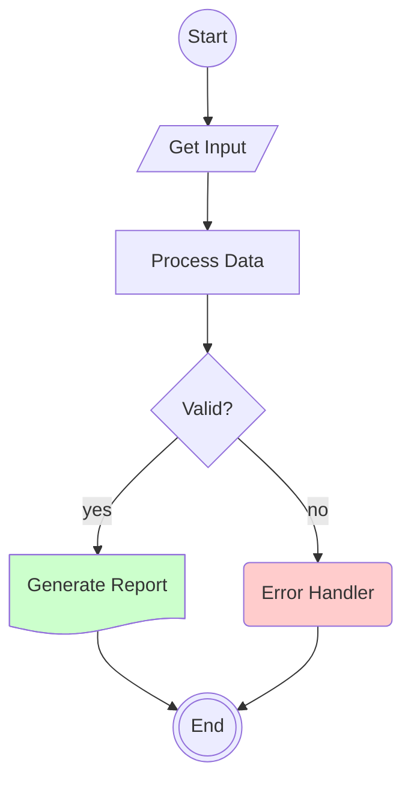

# Mermaid Flowchart Complete Shape Reference

This is a comprehensive reference for all Mermaid flowchart shapes using modern syntax.

## Complete Shape List

| Semantic Name | Shape Name | Short Name | Modern Syntax | Use Case |
|---------------|------------|------------|---------------|----------|
| Start | Circle | `circle` | `a@{ shape: circle, label: "Start" }` | Starting point |
| Start | Small Circle | `sm-circ` | `a@{ shape: sm-circ, label: "Start" }` | Small starting point |
| Stop | Double Circle | `dbl-circ` | `a@{ shape: dbl-circ, label: "Stop" }` | Stop point |
| Stop | Framed Circle | `fr-circ` | `a@{ shape: fr-circ, label: "Stop" }` | Stop point |
| Terminal Point | Stadium | `stadium` | `a@{ shape: stadium, label: "Terminal" }` | Terminal point |
| Process | Rectangle | `rect` | `a@{ shape: rect, label: "Process" }` | Standard process |
| Subprocess | Framed Rectangle | `fr-rect` | `a@{ shape: fr-rect, label: "Subprocess" }` | Subprocess |
| Decision | Diamond | `diam` | `a@{ shape: diam, label: "Decision?" }` | Decision/question |
| Event | Rounded Rectangle | `rounded` | `a@{ shape: rounded, label: "Event" }` | Event |
| Prepare | Hexagon | `hex` | `a@{ shape: hex, label: "Prepare" }` | Preparation step |
| Data Input/Output | Lean Right | `lean-r` | `a@{ shape: lean-r, label: "Input" }` | Input/output |
| Data Input/Output | Lean Left | `lean-l` | `a@{ shape: lean-l, label: "Output" }` | Output/input |
| Document | Document | `doc` | `a@{ shape: doc, label: "Document" }` | Document |
| Multi-Document | Stacked Document | `docs` | `a@{ shape: docs, label: "Docs" }` | Multiple documents |
| Database | Cylinder | `cyl` | `a@{ shape: cyl, label: "Database" }` | Database storage |
| Disk Storage | Lined Cylinder | `lin-cyl` | `a@{ shape: lin-cyl, label: "Disk" }` | Disk storage |
| Direct Access Storage | Horizontal Cylinder | `h-cyl` | `a@{ shape: h-cyl, label: "Storage" }` | Direct access |
| Manual Input | Sloped Rectangle | `sl-rect` | `a@{ shape: sl-rect, label: "Manual" }` | Manual input |
| Manual Operation | Trapezoid Top | `trap-t` | `a@{ shape: trap-t, label: "Manual" }` | Manual task |
| Manual File | Flipped Triangle | `flip-tri` | `a@{ shape: flip-tri, label: "File" }` | Manual file |
| Priority Action | Trapezoid Bottom | `trap-b` | `a@{ shape: trap-b, label: "Priority" }` | Priority action |
| Comment | Curly Brace | `brace` | `a@{ shape: brace, label: "Comment" }` | Comment |
| Comment Right | Curly Brace Right | `brace-r` | `a@{ shape: brace-r, label: "Comment" }` | Right comment |
| Comment Both | Curly Braces | `braces` | `a@{ shape: braces, label: "Comment" }` | Both sides comment |
| Junction | Filled Circle | `f-circ` | `a@{ shape: f-circ, label: "Join" }` | Junction point |
| Fork/Join | Filled Rectangle | `fork` | `a@{ shape: fork, label: "Fork" }` | Fork/join |
| Collate | Hourglass | `hourglass` | `a@{ shape: hourglass, label: "Collate" }` | Collate operation |
| Extract | Triangle | `tri` | `a@{ shape: tri, label: "Extract" }` | Extraction |
| Card | Notched Rectangle | `notch-rect` | `a@{ shape: notch-rect, label: "Card" }` | Card |
| Delay | Half-Rounded Rectangle | `delay` | `a@{ shape: delay, label: "Delay" }` | Delay |
| Display | Curved Trapezoid | `curv-trap` | `a@{ shape: curv-trap, label: "Display" }` | Display |
| Divided Process | Divided Rectangle | `div-rect` | `a@{ shape: div-rect, label: "Divided" }` | Divided process |
| Internal Storage | Window Pane | `win-pane` | `a@{ shape: win-pane, label: "Storage" }` | Internal storage |
| Lined Document | Lined Document | `lin-doc` | `a@{ shape: lin-doc, label: "Document" }` | Lined document |
| Lined Process | Lined Rectangle | `lin-rect` | `a@{ shape: lin-rect, label: "Process" }` | Lined process |
| Loop Limit | Notched Pentagon | `notch-pent` | `a@{ shape: notch-pent, label: "Loop" }` | Loop limit |
| Multi-Process | Stacked Rectangle | `st-rect` | `a@{ shape: st-rect, label: "Processes" }` | Multiple processes |
| Odd | Odd | `odd` | `a@{ shape: odd, label: "Odd" }` | Odd shape |
| Paper Tape | Flag | `flag` | `a@{ shape: flag, label: "Paper" }` | Paper tape |
| Stored Data | Bow Tie Rectangle | `bow-rect` | `a@{ shape: bow-rect, label: "Data" }` | Stored data |
| Summary | Crossed Circle | `cross-circ` | `a@{ shape: cross-circ, label: "Summary" }` | Summary |
| Tagged Document | Tagged Document | `tag-doc` | `a@{ shape: tag-doc, label: "Tagged" }` | Tagged document |
| Tagged Process | Tagged Rectangle | `tag-rect` | `a@{ shape: tag-rect, label: "Tagged" }` | Tagged process |
| Text Block | Text Block | `text` | `a@{ shape: text, label: "Text" }` | Text block |
| Com Link | Lightning Bolt | `bolt` | `a@{ shape: bolt, label: "Link" }` | Communication link |

## Connection Types

| Type | Syntax | Visual | Use Case |
|------|--------|--------|----------|
| Solid arrow | `a --> b` | ──> | Standard flow |
| Labeled arrow | `a -->\|label\| b` | ─label─> | Decision branches |
| Dotted arrow | `a -.-> b` | ····> | Optional/weak |
| Thick arrow | `a ==> b` | ══> | Emphasis |
| Open link | `a --- b` | ─── | Undirected |
| Dotted link | `a -.- b` | ···· | Weak connection |
| Thick link | `a === b` | ═══ | Strong connection |
| Chained | `a --> b --> c` | Multiple hops | Sequential flow |

## Styling Reference

### Defining Classes

```mermaid
classDef className fill:#color,stroke:#color,stroke-width:2px,color:#textcolor
```

**Common color patterns:**

```mermaid
classDef success fill:#ccffcc,stroke:#00cc00
classDef error fill:#ffcccc,stroke:#cc0000
classDef warning fill:#ffffcc,stroke:#cccc00
classDef info fill:#ccccff,stroke:#0000cc
```

### Applying Classes

**To single node:**

```mermaid
a:::className
```

**To multiple nodes:**

```mermaid
a:::className
b:::className
c:::className
```

## Graph Directions

| Direction | Code | Layout |
|-----------|------|--------|
| Left to Right | `graph LR` | Horizontal |
| Right to Left | `graph RL` | Horizontal (reverse) |
| Top to Bottom | `graph TD` or `graph TB` | Vertical |
| Bottom to Top | `graph BT` | Vertical (reverse) |

## Example: Complete Workflow



## Obsidian Compatibility Notes

- Modern `@{ shape: ... }` syntax works in Obsidian with Mermaid plugin v10+
- If using older Obsidian versions, may need to use legacy syntax
- Always test diagrams in your specific Obsidian environment

## Source

Based on Mermaid documentation: <https://docs.mermaidchart.com/mermaid-oss/syntax/flowchart.html>
